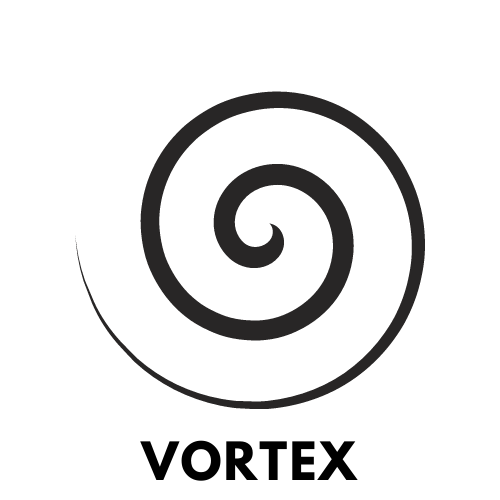

#####          
#####    

### 
 A Browser made for developers. 

## Running Vortex
##### To run Vortex, run the following code:
    git clone https://github.com/1upCommunity/Vortex.git
    cd Vortex/Vortex
    python __main__.py
##### (assuming that you already have git and python installed)
##### Dependencies are automatically installed and updated.
